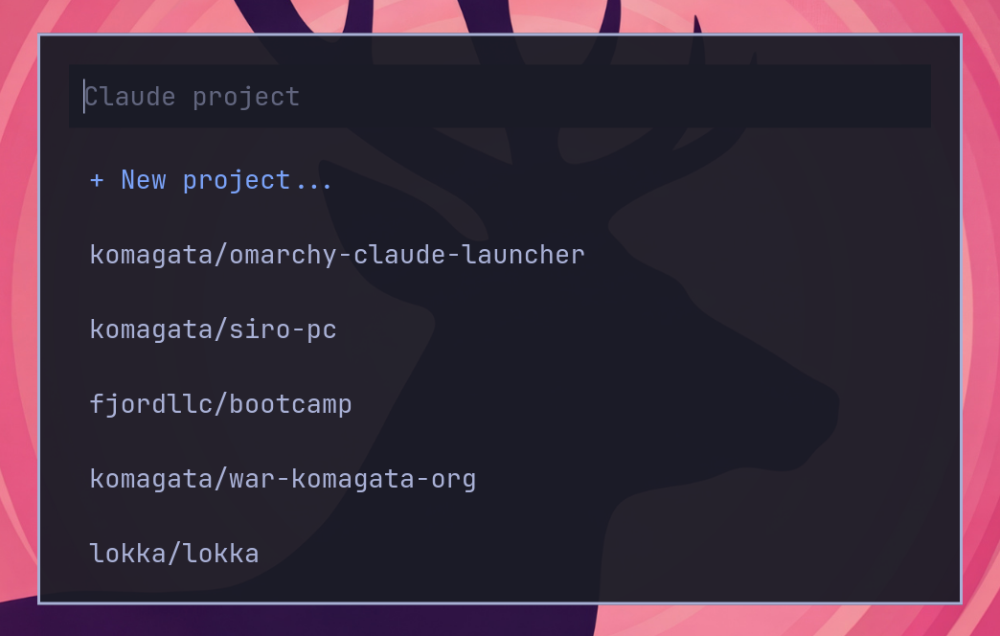

# omarchy-claude-launcher

A keyboard-driven project launcher for [Claude Code](https://claude.com/claude-code) on [omarchy](https://omarchy.org/) / Hyprland.

Press **Super+I**, pick a project, and Claude Code opens in a tmux window. All projects share one terminal and one tmux session — switch between them with `Ctrl+B n/p/w`.



## Why

If you use Claude Code across several projects, you end up doing this many times a day:

1. Open a terminal
2. `cd ~/Works/some-org/some-project`
3. `claude -c` (or `claude` if it's a new project)
4. Remember to close the old terminal you left open

This launcher collapses that to one keystroke. It also keeps every project's Claude session inside a single persistent tmux session, so you can walk away and come back without losing state.

## How it works

- A single tmux session named `claude` holds one window per project.
- On first use the launcher spawns a terminal attached to that session.
- Subsequent invocations add or switch to project windows inside the same terminal, and raise that terminal to the foreground via `hyprctl`.
- If a Claude Code conversation already exists for a project, the launcher resumes it with `claude -c`. Otherwise it starts a fresh session.
- When Claude exits (for any reason — trust prompts, `/exit`, errors), you're dropped to a prompt that restarts Claude on Enter or exits on Ctrl-D.

## Requirements

- [omarchy](https://omarchy.org/) (or any Hyprland setup that provides `walker`, `hyprctl`, and a supported terminal)
- `tmux`
- `claude` ([Claude Code CLI](https://claude.com/claude-code))
- A terminal emulator supporting `--class` and `-e` (alacritty / ghostty / foot / kitty)

## Install

```bash
git clone https://github.com/komagata/omarchy-claude-launcher.git
cd omarchy-claude-launcher
./install.sh
```

The installer:

1. Checks dependencies
2. Copies `bin/claude-launcher` to `~/.local/bin/`
3. Appends the `Super+I` keybind to `~/.config/hypr/bindings.conf` (with confirmation)

Then reload Hyprland:

```bash
hyprctl reload
```

### Manual install

```bash
cp bin/claude-launcher ~/.local/bin/
chmod +x ~/.local/bin/claude-launcher
# Add this line to ~/.config/hypr/bindings.conf:
echo 'bindd = SUPER, I, Claude project launcher, exec, claude-launcher' >> ~/.config/hypr/bindings.conf
hyprctl reload
```

## Usage

Press **Super+I**. A walker popup appears with:

```
+ New project...
● komagata/siro-pc          (active — currently open in tmux)
● lokka/lokka               (active)
  komagata/rom-sorter       (not open)
  komagata/bin
  ...
```

- **Select an existing project** → the launcher switches to that project's tmux window (creates it if needed) and focuses the terminal.
- **Select `+ New project...`** → enter a name (e.g. `myapp` or `acme/webapp`), and it creates `$CLAUDE_LAUNCHER_WORKS_DIR/<ns>/<name>/` and starts Claude there.

### Switching projects inside the terminal

Once the terminal is open, you can use standard tmux keybindings:

- `Ctrl+B n` — next window
- `Ctrl+B p` — previous window
- `Ctrl+B w` — window picker
- `Ctrl+B d` — detach (keeps everything running in the background)

## Configuration

All configuration is via environment variables. Add these to your shell profile (`~/.bashrc`, `~/.zshrc`):

| Variable | Default | Description |
|---|---|---|
| `CLAUDE_LAUNCHER_WORKS_DIR` | `$HOME/Works` | Root directory containing your projects |
| `CLAUDE_LAUNCHER_DEFAULT_NS` | *(unset)* | Fallback namespace when you type just a bare name on creation |
| `CLAUDE_LAUNCHER_TERMINAL` | `$TERMINAL`, else `alacritty` | Terminal emulator |
| `CLAUDE_LAUNCHER_SESSION` | `claude` | tmux session name |
| `CLAUDE_LAUNCHER_DEBUG` | *(unset)* | Set to `1` to write debug logs to `/tmp/claude-launcher.log` |

### Directory layout

The launcher assumes a two-level layout:

```
$CLAUDE_LAUNCHER_WORKS_DIR/
├── <namespace>/
│   ├── <project-name>/
│   └── <another-project>/
└── <another-namespace>/
    └── <project-name>/
```

For example:

```
~/Works/
├── komagata/
│   ├── siro-pc/
│   └── rom-sorter/
├── lokka/
│   └── lokka/
└── fjordllc/
    └── bootcamp/
```

If you prefer a flat layout (one level deep), this launcher isn't for you right now — feel free to open an issue or PR.

## Troubleshooting

**The terminal opens and closes immediately.**
Your terminal may have `gtk-single-instance=detect` or a similar setting that routes new invocations to an existing process, where the `-e` command isn't honored. Try setting `CLAUDE_LAUNCHER_TERMINAL=alacritty` (alacritty always spawns a fresh process).

**On certain NVIDIA cards, ghostty crashes with `LLVM ERROR` when spawned as a subprocess.**
This is a mesa/llvmpipe bug unrelated to this project. Workaround: `export CLAUDE_LAUNCHER_TERMINAL=alacritty`.

**The launcher says "Please use ns/name format".**
Either prefix the name with a namespace (`myorg/myapp`) or set `CLAUDE_LAUNCHER_DEFAULT_NS` in your shell profile.

**I want to see what the script is doing.**
Run `CLAUDE_LAUNCHER_DEBUG=1 claude-launcher` and check `/tmp/claude-launcher.log`.

## Contributing

Issues and pull requests welcome. Keep in mind this is an opinionated tool: it targets omarchy users with a two-level directory layout. Significant changes to those assumptions should be discussed in an issue first.

## License

MIT — see [LICENSE](LICENSE).
