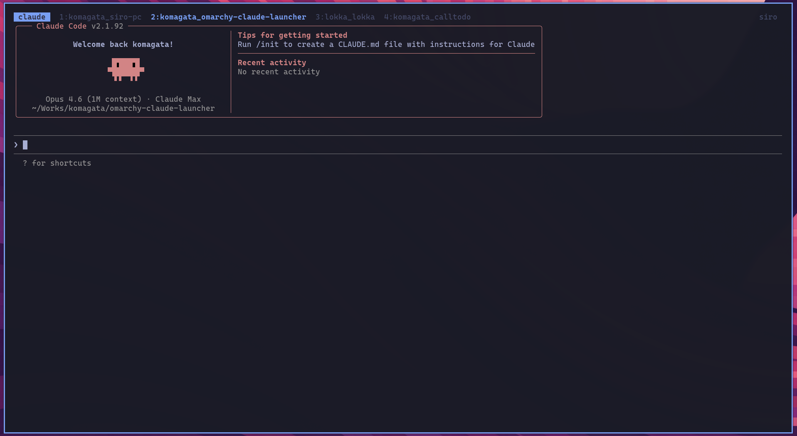

# omarchy-coding-agent-launcher

A keyboard-driven project launcher for terminal coding agents on [omarchy](https://omarchy.org/) / Hyprland.

Press **Super+I**, pick a project, and your selected coding agent opens in a tmux pane. All projects share one terminal and one tmux session, so active sessions stay together and can be restored after the terminal closes.


## Supported agents

Select the agent with `CODING_AGENT_LAUNCHER_AGENT`:

- `claude` (default)
- `codex`
- `gemini`
- `opencode`

Set a per-project agent by writing `claude`, `codex`, `gemini`, or `opencode` to `.agents/agent` in the project directory. The launcher also provides `+ Set project agent...` in the picker to write this file for you. Projects without `.agents/agent` use `CODING_AGENT_LAUNCHER_AGENT`.

The launcher manages projects and tmux panes; each agent still owns its own authentication, model configuration, permissions, and session storage.

For `claude`, `codex`, and `gemini`, the launcher resumes the most recent conversation for the project directory when possible and starts a fresh session otherwise.

## Why

If you use coding agents across several projects, you end up doing this many times a day:

1. Open a terminal
2. `cd ~/Works/some-org/some-project`
3. Start `claude`, `codex`, `gemini`, or `opencode`
4. Remember which terminal belongs to which project

This launcher collapses that to one keystroke and keeps every project in a single persistent tmux session.

## How it works

- A single tmux session named `coding-agents` holds one tiled pane per project.
- On first use the launcher spawns a terminal attached to that session.
- Subsequent invocations add or switch to project panes inside the same terminal, and raise that terminal via `hyprctl`.
- New worktrees are created under `.agents/worktrees/<name>`.
- Existing `.claude/worktrees` entries are left in place for Claude Code compatibility and appear as `project [name @claude]` if present.

## Requirements

- [omarchy](https://omarchy.org/) or any Hyprland setup with `walker`, `hyprctl`, and a supported terminal
- `tmux`
- One supported coding agent CLI: `claude`, `codex`, `gemini`, or `opencode`
- A terminal emulator supporting `--title` and `-e` (alacritty / ghostty / foot / kitty)

## Install

```bash
git clone https://github.com/komagata/omarchy-coding-agent-launcher.git
cd omarchy-coding-agent-launcher
./install.sh
```

The installer:

1. Checks dependencies
2. Copies `bin/coding-agent-launcher` to `~/.local/bin/`
3. Appends the `Super+I` keybind to `~/.config/hypr/bindings.conf` with confirmation

Then reload Hyprland:

```bash
hyprctl reload
```

### Manual install

```bash
cp bin/coding-agent-launcher ~/.local/bin/
chmod +x ~/.local/bin/coding-agent-launcher
echo 'bindd = SUPER, I, Coding agent launcher, exec, coding-agent-launcher' >> ~/.config/hypr/bindings.conf
hyprctl reload
```

## Usage

Press **Super+I**. A walker popup appears with:

```text
+ New project...
+ New worktree...
+ Set project agent...
- Delete project/worktree...
● komagata/siro-pc          (idle)
⚙ lokka/lokka               (working)
  komagata/rom-sorter       (not open)
```

- **Select an existing project** to switch to its tmux pane, creating it if needed.
- **Select `+ New project...`** to create `$CODING_AGENT_LAUNCHER_WORKS_DIR/<ns>/<name>/` and start the selected agent there.
- **Select `+ New worktree...`** to create a git worktree under `.agents/worktrees/<name>`.
- **Select `+ Set project agent...`** to choose which agent a project or worktree should use.
- **Type a name that is not listed** to create it on the spot. With `CODING_AGENT_LAUNCHER_DEFAULT_NS=me`, typing `chat` creates `$CODING_AGENT_LAUNCHER_WORKS_DIR/me/chat/`; otherwise use `ns/name`.



### Switching projects inside the terminal

With omarchy's default tmux config:

- `Alt+Left` / `Alt+Right` - previous / next pane or window, depending on your tmux config
- `Ctrl+B w` - window picker
- `Ctrl+B d` - detach and keep everything running in the background

## Configuration

All configuration is via environment variables. Add these to your shell profile (`~/.bashrc`, `~/.zshrc`):

| Variable | Default | Description |
|---|---:|---|
| `CODING_AGENT_LAUNCHER_AGENT` | `claude` | Agent to run: `claude`, `codex`, `gemini`, or `opencode` |
| `CODING_AGENT_LAUNCHER_WORKS_DIR` | `$HOME/Works` | Root directory containing your projects |
| `CODING_AGENT_LAUNCHER_DEFAULT_NS` | *(unset)* | Fallback namespace when creating a bare project name |
| `CODING_AGENT_LAUNCHER_TERMINAL` | `$TERMINAL`, else `alacritty` | Terminal emulator |
| `CODING_AGENT_LAUNCHER_SESSION` | `coding-agents` | tmux session name |
| `CODING_AGENT_LAUNCHER_AGENT_ARGS` | *(empty)* | Extra arguments passed to every agent invocation |
| `CODING_AGENT_LAUNCHER_CLAUDE_ARGS` | *(empty)* | Extra arguments for `claude` |
| `CODING_AGENT_LAUNCHER_CODEX_ARGS` | *(empty)* | Extra arguments for `codex` |
| `CODING_AGENT_LAUNCHER_GEMINI_ARGS` | *(empty)* | Extra arguments for `gemini` |
| `CODING_AGENT_LAUNCHER_OPENCODE_ARGS` | *(empty)* | Extra arguments for `opencode` |
| `CODING_AGENT_LAUNCHER_DEBUG` | *(unset)* | Set to `1` to write debug logs to `/tmp/coding-agent-launcher.log` |

Common args are applied before agent-specific args.

### Per-Project Agents

Create this file inside a project to override `CODING_AGENT_LAUNCHER_AGENT` for that project:

```text
.agents/agent
```

The file should contain one supported agent name:

```text
codex
```

Worktrees can have their own `.agents/agent`. If a worktree does not define one, it inherits the parent project's `.agents/agent` when present.

Changing this setting affects new panes. If the project is already open in tmux, close that pane and open the project again to start the newly selected agent.

### Directory layout

The launcher assumes a two-level layout:

```text
$CODING_AGENT_LAUNCHER_WORKS_DIR/
├── <namespace>/
│   ├── <project-name>/
│   └── <another-project>/
└── <another-namespace>/
    └── <project-name>/
```

If you prefer a flat layout, this launcher does not support it right now.

## Session commands

```bash
coding-agent-launcher --save
coding-agent-launcher --restore
coding-agent-launcher --shutdown
```

`--shutdown` asks each active agent pane to write a handover note to `HANDOVER.md`, waits briefly for activity to stop, saves the session list, and kills the tmux session.

## Troubleshooting

**The terminal opens and closes immediately.**
Your terminal may route new invocations to an existing process where the `-e` command is not honored. Try `export CODING_AGENT_LAUNCHER_TERMINAL=alacritty`.

**The launcher says "Please use ns/name format".**
Either prefix the name with a namespace (`myorg/myapp`) or set `CODING_AGENT_LAUNCHER_DEFAULT_NS`.

**I want to see what the script is doing.**
Run `CODING_AGENT_LAUNCHER_DEBUG=1 coding-agent-launcher` and check `/tmp/coding-agent-launcher.log`.

## Contributing

Issues and pull requests welcome. Keep in mind this is an opinionated tool: it targets omarchy users with a two-level directory layout. Significant changes to those assumptions should be discussed in an issue first.

## License

MIT - see [LICENSE](LICENSE).
